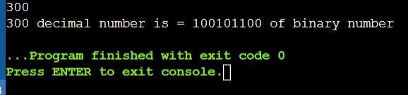
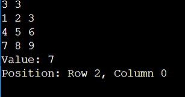
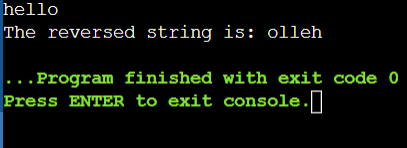
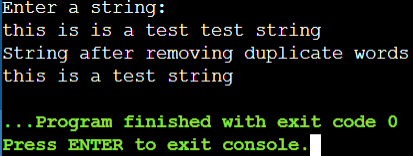

# 19AI304-Fundamentals-of-C-Programming-2025-Odd-M3
# IAPR-3- Module 3 - FoC
## 5. Implementation of one-dimensional array and multidimensional array.
## 6. Implementation of string manipulation.
# Ex.No:11
  Formulate a C program to convert a given decimal number into its binary equivalent and display it.
# Date : 
# Aim:
To formulate a C program to convert a decimal number into its binary equivalent and display it.
# Algorithm:
### Step 1:
  Start
### Step 2: 
  Include the standard input-output library: #include<stdio.h>.
### Step 3: 
  Declare variables: num (input number), rem (remainder), binary[] (array to store binary digits), and loop counters i and k.
### Step 4: 
  Read the decimal number from the user.
### Step 5: 
  Initialize i = 0.
### Step 6: 
  Repeat while num > 0:
  Divide num by 2 and store the remainder in binary[i].
  Increment i.
  Update num = num / 2.
### Step 7: 
  Display the binary digits in reverse order (from i-1 down to 0).
### Step 8: 
   Stop
# Program:
```
#include <stdio.h>
int main(){
   int n;
   scanf("%d",&n);
   int a=n;
   int c=0,b=1;
   while(n!=0){
       int rem=n%2;
       c+=rem*b;
       n/=2;
       b*=10;
   }
   printf("%d decimal number is = %d of binary number",a,c);
   return 0;
}
```
# Output:

# Result: 
Thus, the program was implemented and executed successfully, and the required output was obtained.


# 19AI304-Fundamentals-of-C-Programming-2025-Odd-M3
# IAPR-3- Module 3 - FoC
# Ex.No:12
  Develop a C program to read a matrix and find its saddle point. A saddle point is an element that is the minimum in its row and also the maximum in its column. If such an element exists, display its position and value.
# Date : 
# Aim:
  To develop a C program that inputs a matrix, checks each row for its minimum element, verifies whether that element is also the maximum in its corresponding column, and displays the saddle point and its position if it exists.
# Algorithm:
### Step 1:
  Start
### Step 2: 
  Include the standard input-output library: #include<stdio.h>.
### Step 3: 
 Declare variables i, j, k, m, min, max and a position array pos[2][2].
### Step 4: 
 Read the order of the square matrix m.
### Step 5: 
 Declare an m × m matrix and read its elements.
### Step 6: 
 Display the matrix.
### Step 7: 
   For each row `i` from `0` to `m−1`:
- **Step 7.1:** Set `min` as the first element of the row.  
- **Step 7.2:** Scan the row to find its minimum element and store its position in `pos[0]`.  
- **Step 7.3:** Let `j` be the column of this minimum element.  
- **Step 7.4:** Set `max` as the first element of column `j`.  
- **Step 7.5:** Scan column `j` to find its maximum element and store its position in `pos[1]`.  
### Step 8: 
  Check if the row minimum equals the column maximum:
- If `min == max` **and their positions match**, then the element is a **saddle point**.
- Print the saddle point value and its position.
### Step 9: 
  Stop
# Program:
```
#include <stdio.h>

int main() {
    int a[10][10];
    int r, c;
    int i, j, k;
    int min, col;
    int found = 0;

 
    scanf("%d %d", &r, &c);

    for (i = 0; i < r; i++) {
        for (j = 0; j < c; j++) {
            scanf("%d", &a[i][j]);
        }
    }


    for (i = 0; i < r; i++) {
        min = a[i][0];
        col = 0;


        for (j = 1; j < c; j++) {
            if (a[i][j] < min) {
                min = a[i][j];
                col = j;
            }
        }


        for (k = 0; k < r; k++) {
            if (a[k][col] > min)
                break;
        }

        if (k == r) {
           
            printf("Value: %d\n", min);
            printf("Position: Row %d, Column %d\n", i, col);
            found = 1;
            break;
        }
    }

    if (!found)
        printf("No saddle point found in the matrix.\n");

    return 0;
}

```
# Output:

# Result: 
Thus, the program was implemented and executed successfully, and the required output was obtained.


# 19AI304-Fundamentals-of-C-Programming-2025-Odd-M3
# IAPR-3- Module 3 - FoC
# Ex.No:13
  Formulate a C program to reverse a string entered by the user and display the reversed string.
# Date : 
# Aim:
  To formulate a C program that reads a string from the user, reverses it, and prints the reversed string.
# Algorithm:
### Step 1:
  Start
### Step 2: 
  Include the standard input-output library: #include<stdio.h>.
### Step 3: 
  Declare two character arrays: `s` to store the input string and `d` to store the reversed string.
### Step 4: 
  Read the string from the user using `scanf("%[^\n]s", s);`
### Step 5: 
  Find the length of the string `s` by traversing it until the null character `'\0'` is encountered.
### Step 6: 
  Initialize a counter `j` for the reversed string.
### Step 7: 
  Copy characters from the end of `s` to the beginning of `d` using a loop until all characters are copied in reverse order.
### Step 8: 
  Terminate the reversed string `d` with the null character `'\0'`.
### Step 9: 
  Print the reversed string.
### Step 10: 
  Stop
# Program:
```
#include<stdio.h>
#include<string.h>
int main(){
  
    char a[100];
    scanf("%s",a);
    printf("The reversed string is: ");
    int b=strlen(a);
    
    for(int j=b-1;j>=0;j--){
        printf("%c",a[j]);
    }
    
    return 0;
}
```
# Output:

# Result: 
Thus, the program was implemented and executed successfully, and the required output was obtained.

# 19AI304-Fundamentals-of-C-Programming-2025-Odd-M3
# IAPR-3- Module 3 - FoC
# Ex.No:14
  Formulate a C program to count the frequency of each character in a given string and display the count of every character.
# Date : 
# Aim:
  To formulate a C program that accepts a string from the user and calculates the frequency of each character in the string.
# Algorithm:
### Step 1:
  Start
### Step 2: 
  Include the standard input-output library: #include<stdio.h>.
### Step 3: 
  Declare a character array `s[100]` to store the input string, an integer array `visited[256]` initialized to `0`, and variables `i`, `n`, and `count`.
### Step 4: 
  Read the string from the user using `scanf("%[^\n]", s);`
### Step 5: 
  Calculate the length of the string using `strlen(s)` and store it in `n`.
### Step 6: 
 For each character `s[i]` in the string (from `i = 0` to `n - 1`):
 - If `visited[(unsigned char)s[i]] == 0` (character not yet counted):  
  - Initialize `count = 0`.  
  - Loop through the string again and increment `count` for every occurrence of `s[i]`.  
  - Print `s[i]` and its count.  
  - Set `visited[(unsigned char)s[i]] = 1` to mark it as counted.
### Step 7: 
  Repeat Step 6 for all characters.
### Step 8:
  Stop
# Program:
```
#include <stdio.h>

int main() {
    char str[100];
    int freq[256] = {0};  
    int i;


    scanf("%s",str);


    for (i = 0; str[i] != '\0'; i++) {
        freq[(int)str[i]]++;
    }

    printf("Character frequencies:\n");
    for (i = 0; i < 256; i++) {
        if (freq[i] != 0) {
            printf("%c = %d\n", i, freq[i]);
        }
    }

    return 0;
}
```
# Output:


# Result: 
Thus, the program was implemented and executed successfully, and the required output was obtained.


# 19AI304-Fundamentals-of-C-Programming-2025-Odd-M3
# IAPR-3- Module 3 - FoC
# Ex.No:15
  Formulate a C program to remove duplicate words from a given string and display the string with only unique words.
# Date : 
# Aim:
  To formulate a C program to remove duplicate words from a given string and display the string with only unique words.
# Algorithm:
### Step 1:
  Start
### Step 2: 
  Include the standard input-output library: #include<stdio.h>.
### Step 3: 
  Declare a character array `str` to store the input string and a 2D array `words` to store individual words.
### Step 4: 
  Read the input string using `scanf("%[^\n]s", str);`
### Step 5: 
 Split the string into words:
 - Traverse the string character by character.  
 - When a space is encountered, terminate the current word with `'\0'` and move to the next row in `words`.  
 - Otherwise, copy the character into the current word.
### Step 6: 
  Compare each word with all other words to detect duplicates:
  - If a duplicate is found, mark it by setting the first character to `'\0'`.
### Step 7: 
  Print all words that are not marked as duplicates.
### Step 8: 
  Stop
# Program:
```
#include <stdio.h>
#include <string.h>

int main() {
    char str[200], words[50][50];
    int i, j, count = 0;
    int duplicate;

    printf("Enter a string:\n");
    scanf(" %[^\n]", str);

    char *token = strtok(str, " ");
    while (token != NULL) {
        strcpy(words[count], token);
        count++;
        token = strtok(NULL, " ");
    }

    printf("String after removing duplicate words:\n");

    for (i = 0; i < count; i++) {
        duplicate = 0;
        for (j = 0; j < i; j++) {
            if (strcmp(words[i], words[j]) == 0) {
                duplicate = 1;
                break;
            }
        }
        if (duplicate == 0) {
            printf("%s ", words[i]);
        }
    }

    return 0;
}
```
# Output:

# Result: 
Thus, the program was implemented and executed successfully, and the required output was obtained.

